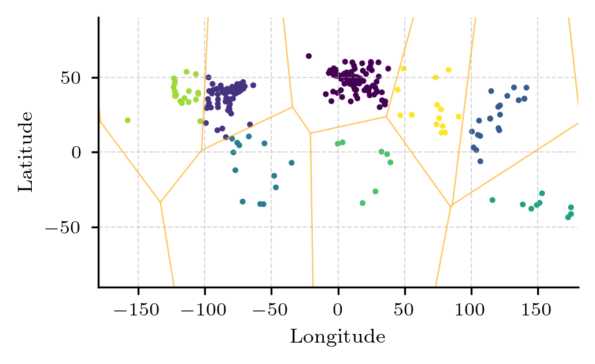
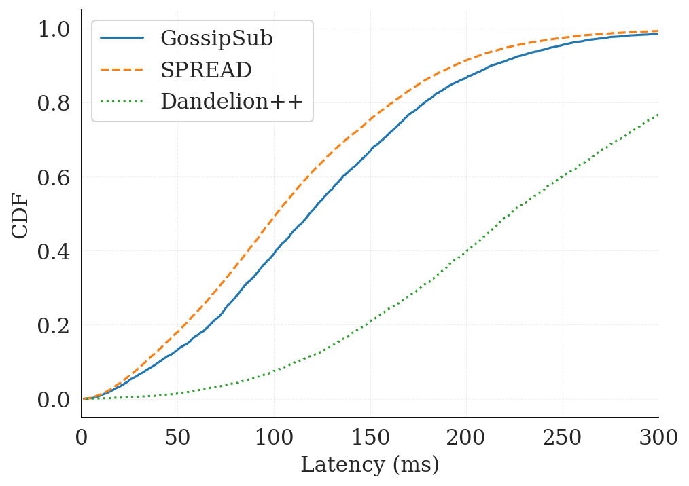

# SPREAD: Extending GossipSub with Efficient Anonymous Dissemination

| Lifecycle Stage | Maturity      | Status | Latest Revision |
| --------------- | ------------- | ------ | --------------- |
| 1A              | Working Draft | Active | r0, 2026-02-13  |

Authors: Diogo Cardoso, Matheus Franco, Rodrigo Rodrigues

## Overview / Summary

GossipSub is the key communication infrastructure underlying societal-critical protocols in ecosystems such as Ethereum. Several characteristics of gossip protocols make this an interesting communication substrate, namely robustness, scalability, and simplicity. However, the important property of anonymity (hiding the true source of a message), is one that is sometimes cited as being desirable to avoid targeted attacks against the sender, but is in practice well-known that it cannot be attained by GossipSub.

In this proposal we describe a protocol extension to GossipSub named SPREAD (Secure Peer-to-Peer Relay for Efficient Anonymous Dissemination), which aims for the best of both worlds: raising the bar against sender deanonymization while, at the same time, improving the efficiency of dissemination in geodistributed settings (i.e., the ability to reach nodes across the globe with low latency). Note that our goal is to raise the bar rather than to fully prevent deanonymization, since source indistinguishability is a quantitative property that depends on the adversary's observation power, rather than an absolute guarantee. These two properties are particularly important for the use of gossip protocols in systems like Ethereum, where targeted attacks can prevent nodes from meeting a certain deadline, such as fulfilling a duty in a given slot, and also where efficient, low-latency transmission is important for the protocols that layer on top of gossip as a communication substrate.

SPREAD consists of two components: a local random walk to preserve anonymity, and a geographically directed propagation for efficient global dissemination, which gives preference to using nearby nodes as a stepping stone, to avoid costly long-distance hops. We are implementing SPREAD as a protocol extension on top of the go-libp2p-pubsub infrastructure. This document presents this proposal, detailing SPREAD's motivation, rationale, and protocol design.

## Terms and definitions

Gossip Protocol - A distributed communication protocol in which nodes repeatedly forward information to a subset of neighboring peers, leading to probabilistic but eventually broadcast of a given message.

Curious Nodes (Honest-but-Curious Observers) - Nodes that follow the protocol correctly but attempt to infer additional information (e.g., the originator of a given message) from observed traffic patterns.

Fanout - The number of peers to which a node forwards a message during a dissemination step.

Random Walk - A forwarding strategy in which each node forwards a message to a single randomly selected peer (possibly with probabilistic branching).

Virtual Coordinates - Latency-estimated coordinates assigned to nodes in a synthetic geometric space, allowing estimation of network distance without direct measurement.

Bernoulli Trial - A probabilistic decision mechanism with two outcomes (success/failure), parameterized by the respective probability value.

Stretch - A performance metric defined as the ratio between the actual end-to-end delivery latency and the direct (usually optimal) communication latency between sender and receiver.

Deanonymization Accuracy - The fraction of times an adversary correctly infers the original sender of a message, based on timing observations across attacker-controlled nodes.

Cluster - A group of nearby nodes, i.e., nodes that are close to each other in the virtual coordinate space and therefore communicate with low latency.

Cobra Walk (Coalescing-Branching Random Walk) - A variant of the random walk in which each node forwards a message to a number of random neighbors given by a branching factor, allowing the walk to occasionally branch out instead of always forwarding to a single peer.

Voronoi Diagram (Dirichlet Tessellation) - A partition of a space into regions according to a set of reference points (centroids), where each region contains the portion of the space that is closer to its centroid than to any other.


## Motivation

Despite the general understanding that gossip protocols can aid in protecting the anonymity of the original sender of any given message, the developers and many users of GossipSub know that it was not designed and is not able to provide such guarantees. In particular, a simple attack on the GossipSub layer is possible by observing message timing at a small set of listener nodes, enabling a centralized coordinator to correlate timings and infer the true source of gossip messages. This class of passive, timing-based attack was first demonstrated on Bitcoin, where transactions were linked to the IP addresses that originated them from a small number of supernodes ([Biryukov et al.](https://doi.org/10.1145/2660267.2660379), [Fanti and Viswanath](https://proceedings.neurips.cc/paper_files/paper/2017/file/6c3cf77d52820cd0fe646d38bc2145ca-Paper.pdf)), and it was later shown to map Ethereum validators to their peer IDs and IP addresses by monitoring attestation propagation over a few epochs (Sharma et al.; [Heimbach et al.](https://www.usenix.org/conference/usenixsecurity25/presentation/heimbach); [Rhea](https://ethresear.ch/t/packetology-validator-privacy/7547)). This is possible despite GossipSub’s use of randomized forwarding to obscure message paths because a validator’s immediate peers (i.e., the validator's direct peers in the gossip overlay) consistently receive and propagate its messages noticeably earlier than others. As such, by deploying a few tens of listener nodes it becomes highly likely that, after a few epochs, one of the listener nodes will become a direct peer (and remain so for several subsequent epochs). Therefore, by keeping track of the first listener node to hear a message over multiple consensus epochs (and which network address that message came from), the coordinator is eventually able to reliably map validators to their network identities with high confidence. Once identified, validators can be selectively targeted (e.g., through denial-of-service), leading to slashing due to missed duties or economic attacks. Crucially, this deanonymization does not rely on any privileged access and can be mounted only by listening to traffic at a small number of well-behaved (honest but curious) observers.

This problem is rooted at a critical tension in the design of gossip protocols: increasing fanout, and more generally improving dissemination speed, reduces anonymity, while limiting exposure through low fanout improves privacy at the cost of propagation speed. Unfortunately, GossipSub fails to strike a sensible balance: it leaks sufficient structural information to enable deanonymization, yet remains inefficient due to latency-insensitive paths that amplify delay and overhead.

Prior research has proposed defenses against this class of attack, most notably [Dandelion](https://doi.org/10.1145/3084459) and [Dandelion++](https://doi.org/10.1145/3224424), which provide stronger, formally analyzed sender-anonymity guarantees by beginning dissemination with a random-walk obfuscation phase. However, these guarantees come at a significant latency cost, which has proven to be a fundamental barrier to their adoption in latency-sensitive settings. In fact, the Ethereum community concluded that, "because of latency constraints [...] this proposal [Dandelion++] is infeasible for the Ethereum consensus layer (at least not for any strong anonymity guarantees)" ([EthResearch discussion](https://ethresear.ch/t/ethereum-consensus-layer-validator-anonymity-using-dandelion-and-rln-conclusion/12698)). This tension is bound to intensify: with the planned reduction of Ethereum's slot time from 12 to 6 seconds ([EIP-7782](https://eips.ethereum.org/EIPS/eip-7782)), the gossip layer faces even stricter performance requirements, resulting in a compound challenge where today's deployments must provide both the required performance and the desired sender-anonymity defenses.

To address this challenge, we propose SPREAD, a new gossip protocol to be implemented as a protocol extension, that raises the bar against sender deanonymization compared to GossipSub while actually providing a more efficient dissemination. Our approach rests on two principles: anonymity via a random walk that obfuscates the message origin, and low latency via topology-aware hop selection. We separate the random-walk hops, which prioritize low latency, from wide-area hops, which try to communicate with nearby nodes as a stepping stone, whenever it is possible to avoid costly long-distance paths. This design suits applications requiring both low latency and sender privacy, including blockchain validator messaging, anonymous communication systems, and censorship-resistant platforms.


## Design of SPREAD: insights and overview

The recent formal work of [Guerraoui et al.](https://arxiv.org/abs/2308.02477) showed the need for gossip protocols designed for anonymity to include a strong random walk component, where each node will often forward a message to a single overlay neighbor, to make the identity of the source difficult to determine. This technique is employed, for example, by the [Dandelion family of protocols](https://arxiv.org/abs/1805.11060), which start with a random walk-based anonymity phase and then probabilistically switch to a dissemination phase with a high fanout. 

However, this raises the problem that, during the random walk phase, where messages are sent to at most one peer per time step, there is a chance that an individual step can be unlucky and cross a slow or distant path. This is problematic since a single slow hop is sufficient to noticeably hurt the average end-to-end performance (as measured by the stretch, or the ratio between the overlay and a direct message connection). This problem is then amplified by the fact that blockchains such as Ethereum layer their multi-step protocols on top of the gossip substrate. Furthermore, the countermeasures to improve the performance, namely to anticipate the switch to the more efficient mode where messages are sent to multiple peers in parallel, are not only still vulnerable to a single long hop in the initial phase, but are also in direct tension with the intended anonymity guarantees.

To navigate this tradeoff effectively, we leverage the insight that the geographic distribution of nodes tends to naturally form clusters corresponding to the world’s most densely populated and economically developed regions (e.g., US East and West Coasts, Europe, Asia, etc.) This allows the design of SPREAD to organize nodes into clusters with the characteristic that the network latency between nodes in the same cluster is low, thus allowing for fast multi-hop dissemination inside a cluster. With this design decision in place, we can then leverage the intra-cluster communication to conduct random walks that allow for building privacy without a significant performance penalty, while occasionally turning to inter-cluster communication for global dissemination.

A second challenge is that the inter-cluster message steps can also be very penalizing for the end-to-end performance if not managed carefully. For instance, we would like to avoid having to send a message from Europe to the East Coast of the US via an overlay hop through Asia or the Middle East. To avoid this, we need to devise an efficient wide area dissemination, since this step is so crucial for performance, and our protocols already achieve anonymity through the intra-cluster communication. To this end, SPREAD attempts that inter-cluster message hops are conducted with nodes in adjacent clusters, so that they can be used as a stepping stone to reach more distant ones. In an idealized routing scenario, there is a single global view of the clusters and how they connect to each other through a high level overlay, which corresponds to a Dirichlet tessellation, dividing the space into regions according to the set of centroids of the clusters. This allows the idealized routing to only send inter-cluster messages to overlay peers in neighboring clusters according to the Dirichlet tessellation.



*Figure 1: Geographic coordinates of a dataset of Internet hosts, augmented with clustering information showing Voronoi cells. An idealized wide-area gossip step would occur only between adjacent cells, but this would require a globally coordinated view of the cell division.* 

However, our goal is to have a fully decentralized protocol that does not rely on a global view for these clusters and their high-level connections. To this end, we decided to instead approximate the idealized routing by having each node build their own local view of its own cluster. Our main insight is to use a virtual coordinate scheme that securely assigns to each now a set of Euclidean coordinates [Vivaldi,Newton] to approximate the idealized routing. With such coordinates in place, each node defines its own view of its cluster as the closest t% of its overlay neighbors in the virtual coordinate space. This allows each node to locally determine the subset of its peers that comprise the neighboring members of its own cluster. Additionally, it is possible to approximate the idealized inter-cluster routing in a fully decentralized way leveraging virtual coordinates. The idea, inspired by natural navigation, is to always avoid a direct jump to a more distant neighbor whenever a closer neighbor exists within the set of non-cluster nodes that are reasonably well-aligned with the distant node (which, intuitively, means there is a closer nearby destination that can serve as a stepping stone). In this case, well-aligned means that the angle bearing to the closer node is within a configurable angular interval of the bearing of the distant node (where this angle bearing is given by the virtual coordinates in the Euclidean space). This, again, allows each node to locally split its set of non-cluster overlay peers into two groups: those that have a closer “stepping stone” member of the set, and therefore should not be used for inter-cluster or any type of forwarding (denoted occluded_remote), and those that do not, and therefore are eligible for inter-cluster hops (unobstructed_remote).


## Protocol overview

The protocol has two components that run in parallel: an algorithm for maintaining a set of overlay peers (or neighbors) and their respective secure virtual coordinates, and the main protocol for sending and propagating gossip messages. The overlay neighbors of node i are automatically partitioned into three subsets: cluster_i,  occluded_remote_i, and unobstructed_remote_i, according to the criteria described before.

With this overlay state in place, we can now define the protocol for broadcasting messages in a simple manner, based on the intuition of combining intra-cluster random walks for ensuring anonymity with inter-cluster efficient dissemination through the unobstructed remote neighbors. The decision to incur in each of these two alternatives is made upon receiving a message to be propagated, simply by flipping a coin that is biased according to a system parameter. The pseudocode of the protocol is explained next, focusing on how to broadcast a message once the cluster information and overlay neighbor formation is in place.

```
1: # constants:
2:  ρintra   # Branching probability (intra-cluster)
3:  ρinter   # Inter-cluster dissemination probability
4:  fanoutintra   # Number of intra-cluster peers when branching
5:  fanoutinter   # Number of peers for inter-cluster dissemination

6: # state variables:
7: neighbors_i # Set of overlay neighbors, partitioned into:
8: cluster_i       # Subset of closeby neighbors in Pi’s cluster
9: unobstructed_remote_i  # Subset of remote neighbors that are not efficiently reachable via another neighbor
10: occluded_remote_i      # Subset of remote neighbors that may be reachable via another neighbor

11: upon receiving or publishing message m do
12:  INTRACLUSTERSPREAD(m)
13:  INTERCLUSTERSPREAD(m)

14: procedure INTRACLUSTERSPREAD(m)
15:  if Bernoulli(ρintra) = 0 then
16:      send m to 1 peer in cluster_i selected uniformly at random
17:  else
18:       send m to fanoutintra peers in cluster_i selected uniformly at random

19: procedure INTERCLUSTERSPREAD(m)
20:  if Bernoulli(ρinter) = 1 then
21:      send m to fanoutinter peers in unobstructed_remote_i selected uniformly at random
```

The protocol iteration contains two steps: the intra-cluster and inter-cluster propagations (lines 10 to 11). Intra-cluster propagation is inspired by the cobra walk (coalescing-branching random walk) algorithm ([Dutta et al.](https://doi.org/10.1145/2817830)), which consists of a random walk that can possibly branch out according to the output of a local Bernoulli trial (line 15). The probability of branching out is denoted by _rhointra_. When it outputs zero (line 16), the node will simply uniformly select a random peer in its cluster, representing the random walk phase. Else, when it outputs one (line 17), the node spreads the message to _fanoutintra_ peers selected uniformly at random in its own cluster, achieving a faster intra-cluster dissemination. The inter-cluster propagation is responsible for the global dissemination and occurs occasionally according to another local Bernoulli trial (line 20), this one with parameter _ρinter_. When the trial outputs zero, a node doesn’t interact with other clusters, keeping all communication within its own cluster. When it outputs one (line 21), the node spreads the message to neighboring nodes that are not too distant (i.e., not “hidden” in the coordinate space by a closer node that can act as a stepping stone), randomly selecting _fanoutinter_ peers in total in a uniform way. Note that the peer propagates the same message multiple times. The reason why the algorithm does not include some logic to stop such duplicated behavior is to guarantee anonymity. In particular, for protocols in which nodes propagate a message only once, [Bellet et al.](https://drops.dagstuhl.de/entities/document/10.4230/LIPIcs.DISC.2020.8) have shown that the attacker would be more likely to identify the source by tracking communication timestamps. However, for real-world applications that continuously generate new messages, termination must be provided to avoid network congestion. A simple approach is to let the node propagate the same message (which can arrive via different neighbors as the message is routed) a fixed number of times, after which it stops. Usually, this parameter controls the reliability of the protocol, and small values are commonly sufficient for real-world network sizes, as described by [Kermarrec et al.](https://doi.org/10.1109/TPDS.2003.1189583). Still, extra reliability mechanisms can be added and in fact are already present in frameworks such as GossipSub, such as heartbeat messages that advertise a list of seen messages and “pull” protocol requests to fetch missing messages.

This message pull mechanism is also valuable for robustness in two additional scenarios. First, under churn, a succession of node failures or departures can prevent the direct propagation from being effective, and the heartbeat-and-pull mechanism lets nodes recover the messages they missed. Second, it helps defend against Byzantine nodes: while simple cryptography prevents such nodes from tampering with message contents, they can still deliberately delay or refuse to forward messages, endangering progress, which the heartbeats and pulls counter.

## Using protocol extensions and coexistence with GossipSub peers

We implement SPREAD as an extension of GossipSub rather than as a separate protocol. In this case, it's an optional feature that a node may choose to support, without requiring agreement from the rest of the network. Each node advertises the extensions it supports through dedicated control fields that are already exchanged when two peers connect, and SPREAD becomes active on a given connection only when both endpoints advertise support for it. Nodes that do not support the extension, or that pair with a peer that does not, simply continue to use standard GossipSub.

To keep its footprint minimal, SPREAD triggers its dissemination without introducing a new message type. A published message uses the standard GossipSub envelope, with an additional field that marks it as a SPREAD message. When a SPREAD-capable node receives such a message, it applies the SPREAD propagation rules and copies the marker onto the messages it relays, so that SPREAD behavior is preserved along the path; a node that does not support the extension simply ignores the marker and forwards the message using standard GossipSub. This forward compatibility is what enables mixed deployments and a smooth, incremental adoption path: a SPREAD message benefits from its privacy-enhancing and efficient dissemination until it reaches a node that does not support the extension, which means that partial anonymity and performance gains are already possible before network-wide adoption.

To build the clusters used for propagation, each SPREAD-capable node maintains virtual coordinates for itself and for the other SPREAD-capable peers it knows about. These coordinates are produced by a Vivaldi process fed with round-trip-time measurements from periodic probes, which is the only addition SPREAD makes to the communication profile of a node. To prevent malicious peers from distorting the coordinate space, each coordinate update is validated by Newton-based checks and rejected whenever it would break a physical invariant.

## Evaluation

We evaluate SPREAD along two complementary dimensions: its resistance to deanonymization attacks and its efficiency in disseminating messages across wide-area networks. We compare it against GossipSub, which is deployed in Ethereum, and Dandelion++, a research proposal designed to improve anonymity. Because SPREAD is implemented as an extension of `go-libp2p-pubsub`, we are able to evaluate the actual production code: we run it over [simnet](https://github.com/marcopolo/simnet), a packet-level simulator that connects the real implementation through virtual links with configurable latency and bandwidth. To reflect a realistic deployment, we draw network topologies from a [global Internet dataset](https://wonderproxy.com/blog/a-day-in-the-life-of-the-internet/) with real round-trip-time measurements between geographically distributed nodes, sampling several topologies and aggregating the results. Dandelion++ is implemented on the same stack, so that all three protocols share the same implementation and differ only in their dissemination strategy.

For a fair comparison, we configure the three protocols so that, in expectation, each node forwards a message to the same number of peers, i.e., they share the same per-node bandwidth budget. We use GossipSub's default mesh size of 6 as the target expected fanout, and tune SPREAD's four parameters and Dandelion++'s parameters to match it. We measure anonymity through a deanonymization accuracy metric under a first-timestamp estimator: for a given fraction of curious nodes, we sample many attacker placements and, for each message, guess its sender as the node that delivered it to a curious node with the earliest timestamp; the accuracy is the fraction of correct guesses. We measure performance through both the absolute delivery latency and the stretch metric, defined as the ratio between the actual end-to-end delivery time of a message and the direct communication latency between its sender and receiver.

### Anonymity

All protocols become more vulnerable as the adversary controls a larger share of the network, but to markedly different degrees. GossipSub is the most exposed: with only 5% of curious nodes, the attacker already succeeds in over 35% of cases, rising to 54% at 20%. Dandelion++ achieves the strongest anonymity, staying below 10% at 5% curious nodes and around 20% even at 20%, owing to its random-walk obfuscation phase. SPREAD sits between the two: at 5% curious nodes its accuracy is in the low-20% range, and at 20% it reaches roughly 45%. Therefore, it reduces the adversary's success rate relative to GossipSub, while trading a modest anonymity gap to Dandelion++ in exchange for significantly better dissemination efficiency.


*Figure 2: Deanonymization (attack) accuracy as a function of the percentage of curious nodes, for GossipSub, Dandelion++, and SPREAD.*

### Performance

SPREAD achieves the most efficient dissemination of the three protocols. At a stretch threshold of 3, over 90% of deliveries complete under SPREAD, compared to about 83% for GossipSub and only 50% for Dandelion++; the gap persists into the tail, where SPREAD and GossipSub approach full coverage well before Dandelion++. Overall, SPREAD lowers the mean stretch by about 23% relative to GossipSub and about 67% relative to Dandelion++, and it shrinks the heavy tail even more markedly, reducing the 99th-percentile stretch by roughly 39% and 74%, respectively. The same ordering holds for absolute latency: half of SPREAD's deliveries complete in under 100 ms, against 40% for GossipSub and 10% for Dandelion++. This tail behavior is particularly important when multi-step protocols are layered on top of gossip, as in Ethereum, since each additional step multiplies the single-hop latency penalty.


*Figure 3: Cumulative distribution of stretch across all sender-receiver pairs, for the three protocols.*



*Figure 4: Cumulative distribution of absolute delivery latency across all sender-receiver pairs.*

### Tuning

Finally, we study how SPREAD's four parameters trade anonymity against performance. Across all of them, increasing the fanout or the branching probability lowers stretch but simultaneously raises attack accuracy, and vice versa, which confirms that SPREAD can be tuned along a continuum: lower values maximize privacy, while higher values shift the balance toward performance. The intra-cluster parameters dominate the stretch profile, whereas the inter-cluster probability acts mostly as an anonymity knob with diminishing returns on performance. The configuration used in the comparisons above deliberately targets a balanced point in this spectrum, rather than either extreme.


*Figure 5: Mean stretch versus deanonymization accuracy for single-parameter variations of SPREAD, at 10% curious nodes. Each line connects successive values of one parameter.*

Overall, these results show that both dimensions of Ethereum's current design can be improved at once: switching to SPREAD lowers deanonymization accuracy relative to GossipSub while also achieving lower mean and tail stretch. Compared to Dandelion++, SPREAD gives up some anonymity, but it avoids the latency overhead that makes strong-anonymity proposals impractical for latency-sensitive settings such as Ethereum's consensus layer.
